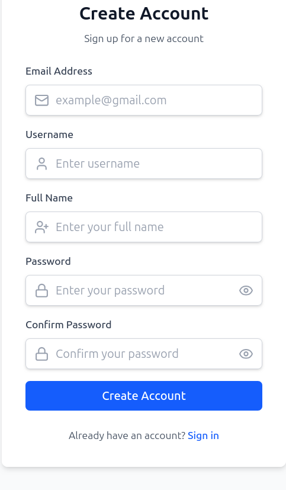
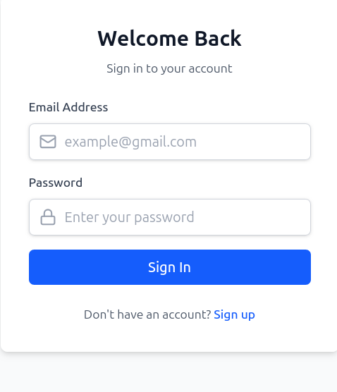
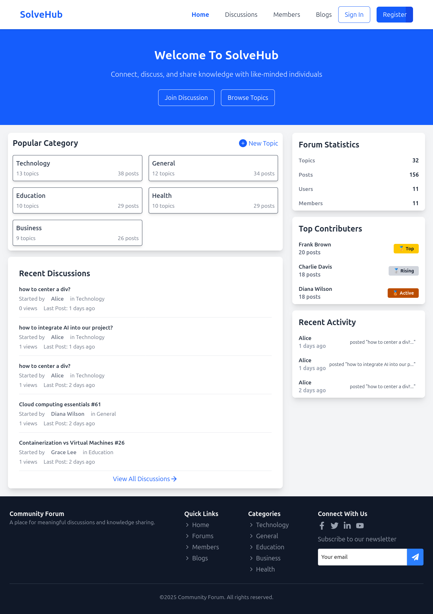
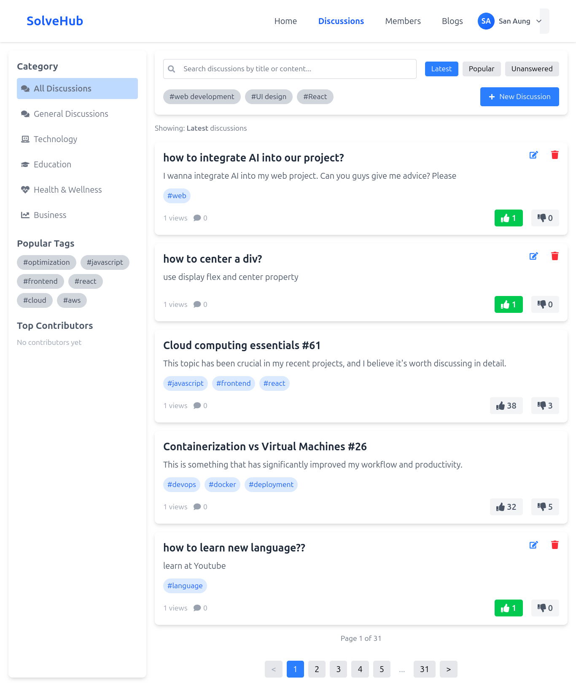
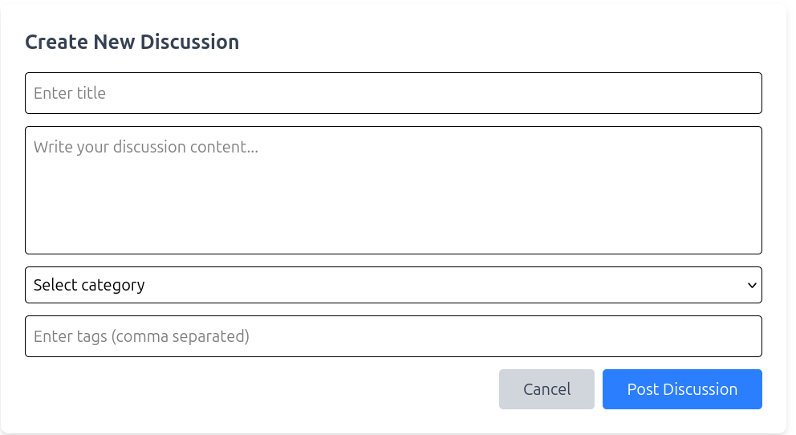
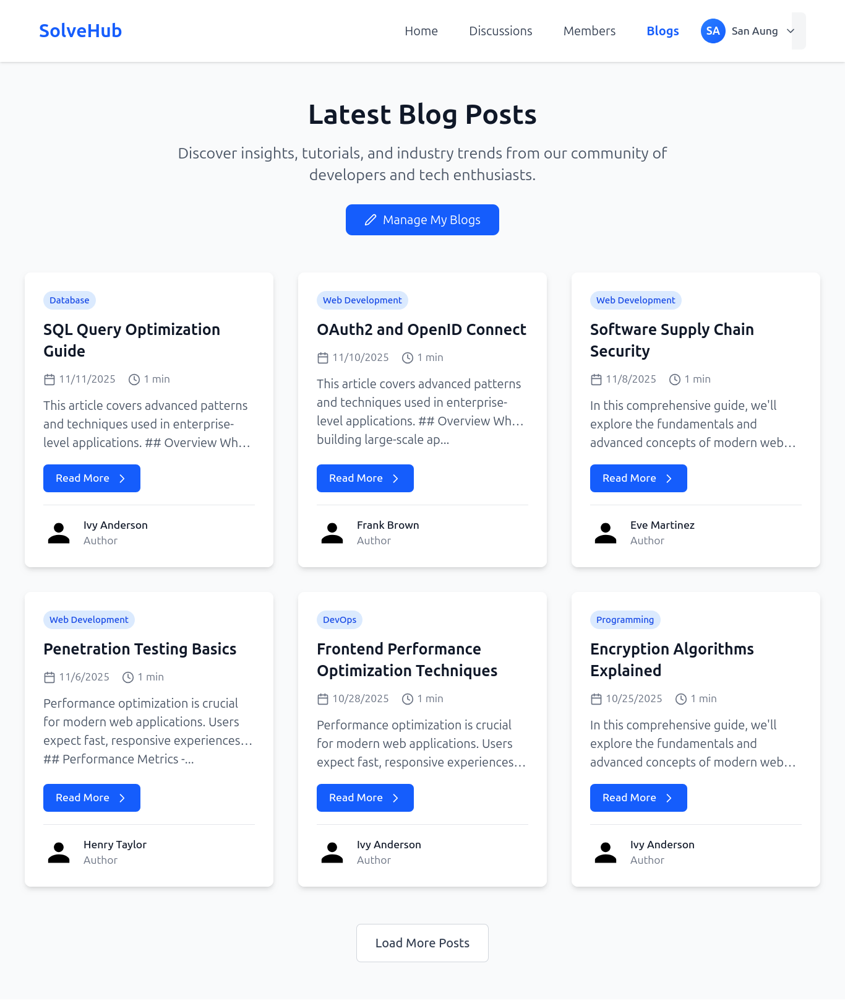
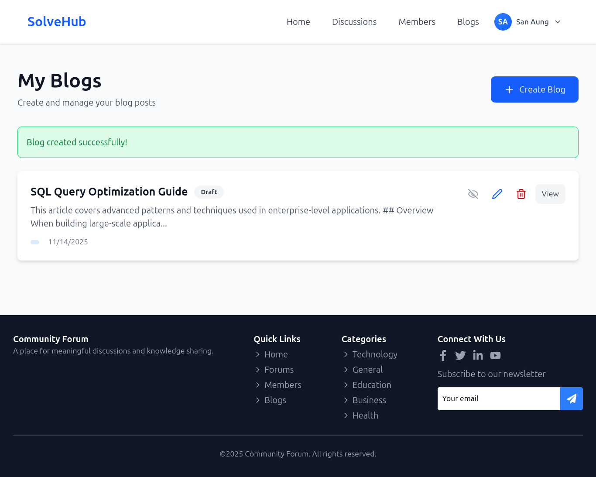
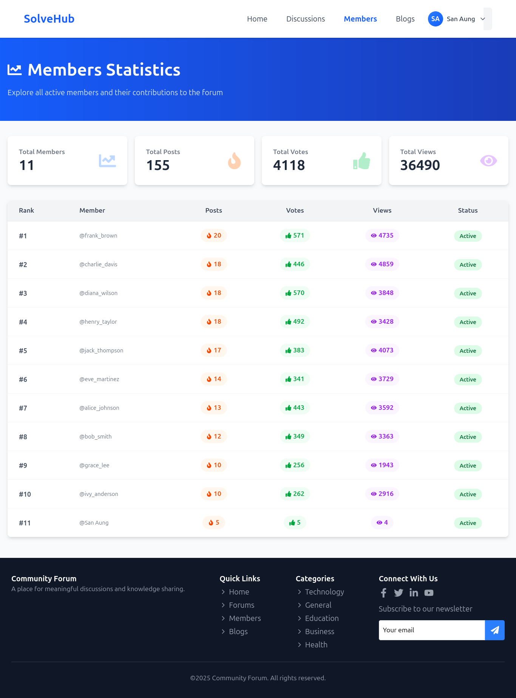

# SolveHub – Full-Stack Q&A Platform

SolveHub is a community-driven Q&A and knowledge-sharing platform that empowers users to ask questions, share insights through blogs, join topic-based discussions, and earn recognition for their contributions. It fosters collaborative learning and professional growth in a developer-focused community.

---

## Purpose

SolveHub is designed to:  
- Enable users to ask and answer technical or general questions  
- Share knowledge and experiences through blog posts  
- Participate in category-based discussions  
- Build professional profiles and gain community recognition  
- Track engagement and contributions through interactive statistics  

---

## Features

### User Authentication

Secure user authentication with JWT-based sessions. New users can register an account, and existing users can log in securely.

**Register**  
Create a new account with email, password, and profile information.


**Sign In**  
Log in securely with your email and password.


---

### Home Page

The home page displays a dashboard with recent discussions, top contributors, trending topics, and quick access to all platform features.


---

### Discussion Forum

Create, explore, and engage in categorized discussions. Upvote, comment, and reply on posts to build community knowledge.

**Discussions List**  
Browse discussions by category, filter by popularity, and search for specific topics.


**Create Discussion**  
Start a new discussion with a title, content, category, and tags to engage the community.


---

### Blog System

Write, publish, and manage blog posts. Share your knowledge and engage with readers through comments.

**Blog Posts**  
Explore published blog articles from community members on various technical topics.


**Create Blog**  
Author and publish your own blog posts to share insights and knowledge with the community.


---

### Member System

Explore and connect with community members. View contributor profiles, activity, and contribution metrics.


---

### User Profile & Settings

Manage your profile, view your contributions, edit personal information, change your password, and track your activity on the platform.


---

## Web Frameworks & Technology  

- **Backend:** FastAPI (Python), SQLAlchemy ORM, MySQL  
- **Frontend:** React , Vite, Tailwind CSS, React Router  
- **Authentication:** JWT, Bcrypt  
- **HTTP Client:** Axios  
- **Icons:** Lucide React,Font Awesome  
- **Database Migrations:** Alembic

---


### Backend Setup
```bash
cd backend
python3 -m venv .venv
source .venv/bin/activate
pip install -r requirements.txt
python3 -m uvicorn main:app --reload
```

The backend will run on `http://localhost:8000`

### Frontend Setup
```bash
cd frontend
npm install
npm run dev
```
The frontend will run on `http://localhost:5173`


## Contributors
- [**San Aung**](https://github.com/Sanaunggithub)
- [**Phone Myat Pyae Sone**](https://github.com/PhoneMyatPyaeSone)

---

## License

This project is licensed under the MIT License. See the [LICENSE](./LICENSE) file for details.

